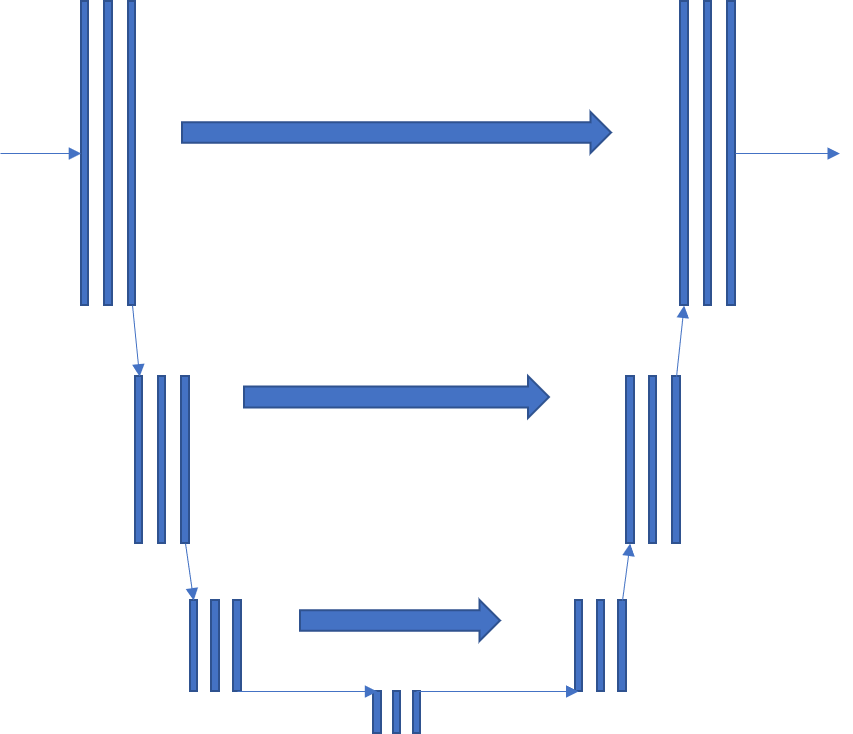

# T-Unet (experimental)
## Overview
 A Temporal-Unet designed to extract vocal from songs
## Dependencies
This repository uses Tensorflow to build and train T-Net, and it requries to run on a TPU in colab environment. However, it is almost effortless to rewrite codes and run in any environment.
## Datasets
[MUSDB18](https://sigsep.github.io/datasets/musdb.html)
## Model
architecture of T-Net is shown as below, it contains 3 down sampling blocks one tranform block and 3 upsampling blocks. Each Downsampling block shrink input to 1/10 on temporal-wise, and vise versa.

## Statics

## References
